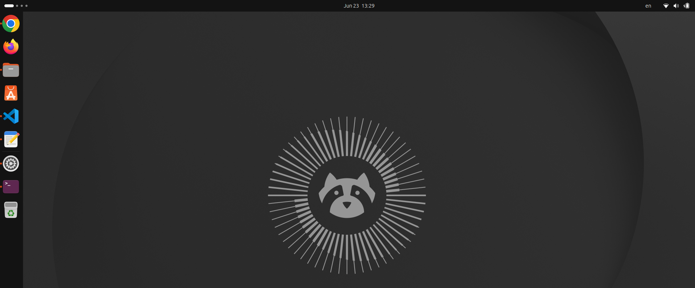

# Hardware I bought & Tutorials
1. Old Laptop
2. USB
3. [Youtube tutorial](https://www.youtube.com/watch?v=8kiykcnT7F4).
4. Pray your laptop surves the process.

# Hardware Context:
Well for this a grabbed my old gaming laptop. Which is a **Lenovo IdeaPad Gaming 3**. Here's what I did:
* **OS:** Ubuntu LTS
* **Installation:** I wiped Windows and installed Ubuntu following [this youtube tutorial](https://www.youtube.com/watch?v=8kiykcnT7F4).

# Result
Following the tutorial and hoping that I didn't break my laptop in the process, here's what I've got.
